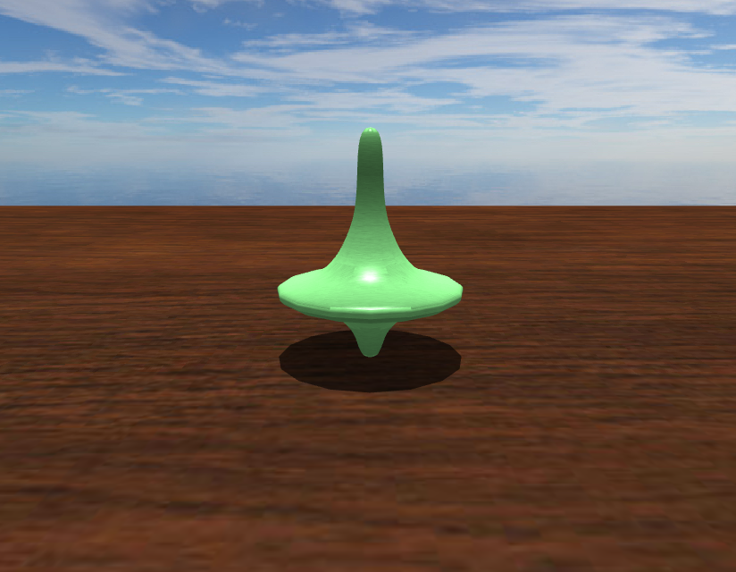

# Spinning-Top-Simulation

Course project for '[Physically-Based Simulation in Computer Graphics](https://cgl.ethz.ch/teaching/simulation14/home.php)' at ETH Zürich.



## YouTube

[https://www.youtube.com/watch?v=vEoIFi5xuzk](https://www.youtube.com/watch?v=vEoIFi5xuzk)

## Installation

The recommended way to compile is using CMake. Clone the repository with all dependencies and use CMake to generate project files for your favourite IDE or build system.

```
git clone https://github.com/tizian/Spinning-Top-Simulation.git --recursive
cd Spinning-Top-Simulation
mkdir build
cd build
cmake ..
make
./build/SpinningTops
```

Pre-compiled binaries for Windows x64 and macOS are available here:

[Windows x64](https://github.com/tizian/Spinning-Top-Simulation/releases/download/v0.1.0/SpinningTops_win64.zip)

[macOS](https://github.com/tizian/Spinning-Top-Simulation/releases/download/v0.1.0/SpinningTops_mac.zip)

## Usage

The program is controlled via keyboard inputs.
The currently active spinning top is highlighted with a green tint.

### Camera movement

<kbd>Space</kbd> Move the camera up.  
<kbd>⇧</kbd> Move the camera down.  
<kbd>W</kbd>, <kbd>A</kbd>, <kbd>S</kbd>, <kbd>D</kbd> Move the camera: Forward, to the left, backward and to the right.  
<kbd>&#x2191;</kbd>, <kbd>&#x2190;</kbd>, <kbd>&#x2193;</kbd>, <kbd>&#x2192;</kbd> Rotate the camera: Pitch up, yaw left, pitch down and yaw right.

<kbd>C</kbd> Reset the camera position and orientation to the default setting.

### Spinning top control

<kbd>0</kbd>, ..., <kbd>6</kbd>, <kbd>9</kbd> Create and drop different spinning top into the scene.  
<kbd>E</kbd> + <kbd>Number</kbd> Create the corresponding spinning top, which rotates.  
<kbd>G</kbd> + <kbd>Number</kbd> Create the corresponding spinning top, which is upside down.  
<kbd>V</kbd> + <kbd>Number</kbd> Create 4 instances of the corresponding spinning top simultaneously.

<kbd>E</kbd>, <kbd>G</kbd> and <kbd>V</kbd> can be combined arbitrarily.  

<kbd>TAB</kbd> Switch the currently active spinning top.  
<kbd>&#x232B;</kbd> Remove the current spinning top from the scene.  
<kbd>Q</kbd> Remove all spinning tops from the scene.

<kbd>R</kbd> Rotate the current spinning top counterclockwise.  
<kbd>T</kbd> Rotate the current spinning top clockwise.

<kbd>Z</kbd> Add a force the current spinning to move it upwards.  
<kbd>U</kbd>, <kbd>H</kbd>, <kbd>J</kbd>, <kbd>K</kbd> Add a force to the current spinning top to move it forwards, to the left, backwards and to the right relative to the default camera position.  
<kbd>I</kbd> Add a force at the top of the current spinning top which points to the right (relative to the default camera position).

### Visual

<kbd>F</kbd> Render the spinning tops as wireframes.  
<kbd>O</kbd> Render the octrees of the spinning tops.  
<kbd>.</kbd> Render the center of mass of the spinning tops.

### Simulation control

<kbd>X</kbd> Slow down the simulation by a factor of 8.

<kbd>P</kbd> Pause the simulation.  
When the simulation is paused you can press:  
<kbd>N</kbd> Do a single forward step in the simulation.  
<kbd>B</kbd> Do a single backward step in the simulation.  
<kbd>M</kbd> + <kbd>N</kbd> or <kbd>B</kbd> Continuously do forward or backward steps in the simulation.

## Used Libraries

* [gl3w](https://github.com/skaslev/gl3w) - OpenGL core profile loading
* [glfw](http://www.glfw.org/) - Window and OpenGL context creation
* [glm](http://glm.g-truc.net/0.9.8/index.html) - Math library
* [stb](https://github.com/nothings/stb) - PNG texture loading
* [tinyobjloader](https://github.com/syoyo/tinyobjloader) - OBJ mesh parser
